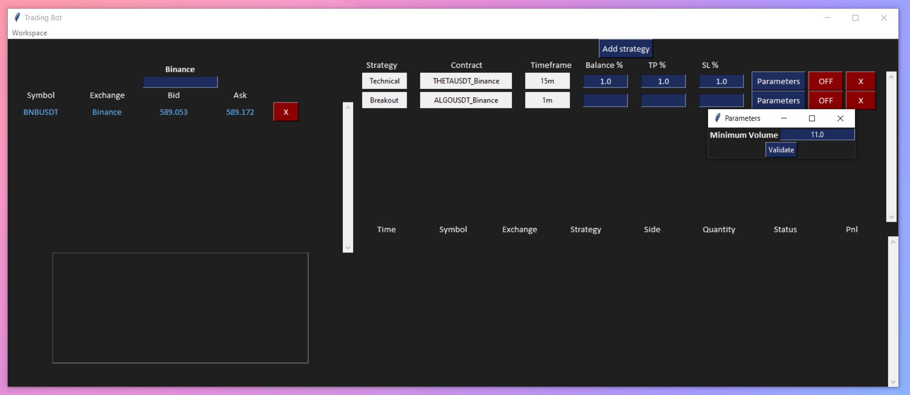

[![LinkedIn][linkedin-shield]][linkedin-url]

<!-- PROJECT LOGO -->
 

  <h3 align="center">Binance-Future-Bot-Trade</h3>

  

    Trading Bot on Binance using Python.
     
     
    <a href="https://github.com/BankNatchapol/Binance-Future-Bot-Trade/issues">Report Bug</a>
    ·
    <a href="https://github.com/BankNatchapol/Binance-Future-Bot-Trade/issues">Request Feature</a>
  

<!-- TABLE OF CONTENTS -->

  
Table of Contents

  <ol>
    <li>
      <a href="#about-the-project">About The Project</a>
    </li>
    <li><a href="#dataset">Dataset</a>
        <ul>
        <li><a href="#event-dataset">Event Dataset</a></li>
      </ul>
    </li>
<li>
      <a href="#getting-started">Getting Started</a>
      <ul>
        <li><a href="#installation">Installation</a></li>
        <li><a href="#etl-processes">ETL Processes</a></li>
      </ul>
    </li>
    <li><a href="#contact">Contact</a></li>
  </ol>

<!-- ABOUT THE PROJECT -->
## About The Project
This project is to create Trading Bot on Binance using Python. There are 2 type, Technical Bot : calculate buy/sell point using technical graph. Breakout Bot : calculate buy/sell poitn using breakout point in graph.

In this project i use TKinter to create GUI.

<!-- APP GUI -->
## App GUI

### Data Model
This is my database Star Schema.

<!-- GETTING STARTED -->
## Getting Started

### Installation
install package with requirements.txt
> pip install - requirements.txt

### ETL Processes
- run python create_keyspace.py to create keyspace
- run python etl.py to do ETL
- watch results in test.ipynb

<!-- CONTACT -->
## Contact

Facebook - [@Natchapol Patamawisut](https://www.facebook.com/natchapol.patamawisut/)

Project Link: [https://github.com/BankNatchapol/ETL-Apache-Cassandra](https://github.com/BankNatchapol/ETL-Apache-Cassandra)

<!-- MARKDOWN LINKS & IMAGES -->
<!-- https://www.markdownguide.org/basic-syntax/#reference-style-links -->
[linkedin-shield]: https://img.shields.io/badge/-LinkedIn-black.svg?style=for-the-badge&logo=linkedin&colorB=555
[linkedin-url]: https://www.linkedin.com/in/natchapol-patamawisut
